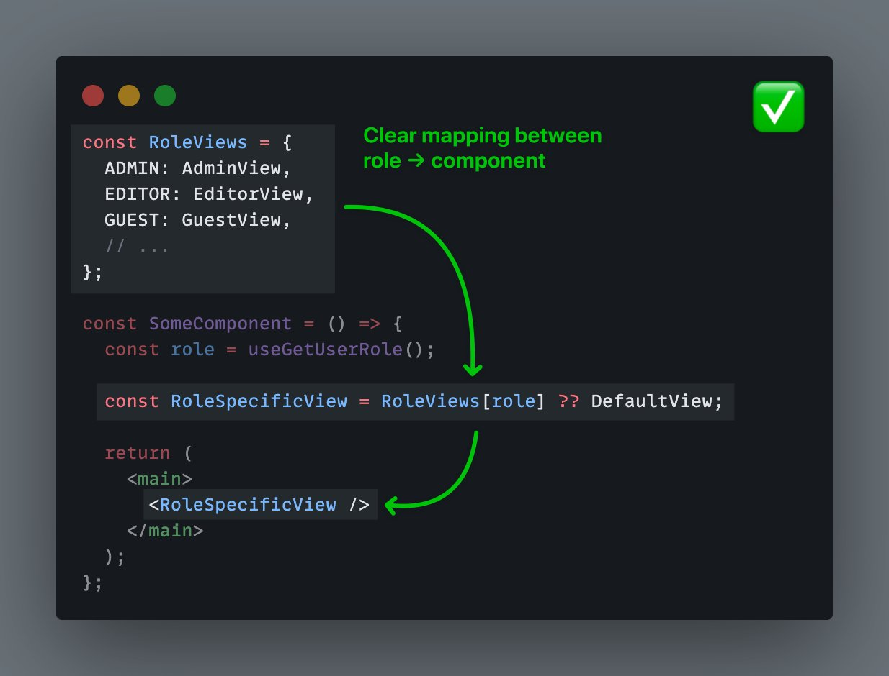
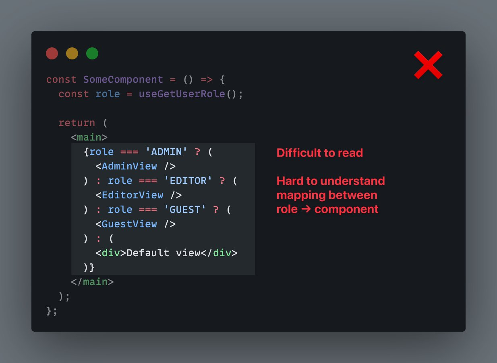

when conditionally rendering component based on some string enum (like a role), use an object to map enum values to components.

This can be cleaner than using conditional operators, and it keeps the logic organized & clear.

